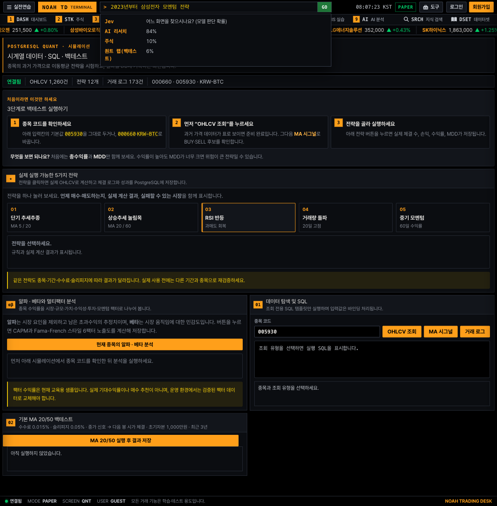

# 자연어 명령 라우터(TypeSafe Jev) — 2026-09-26

터미널 명령 바에 "하닉 골든크로스 백테스트", "비트 김프 지금", "내 계좌에 뭐 있어" 같은 한국어 문장을 넣으면 맞는 화면으로 보낸다. 판단은 TypeSafe의 System One 모델 **Jev**가 하고, 이동·인자 조립·임계값 판정은 코드가 한다.

## 왜 Jev인가

| | Jev(jev-1.13.0) | 참고 |
|---|---|---|
| 가격 | 입력 $0.042 / 100만 토큰, 출력 무료 | [TypeSafe models](https://docs.typesafe.ai/models) |
| 이번 평가 비용 | 119문장 $0.0101(호출당 약 $0.00008) | `evals/jev_intent/results/live.json` |
| 지연(서울 → API, Mac) | p50 231 ms · p95 283 ms | 같은 파일 |
| 출력 | 정해진 선택지의 확률 분포(텍스트 생성 없음) | 이 서비스의 "숫자는 코드가 만든다" 원칙과 맞다 |

- Jev는 **의미만 판단**한다. 숫자·날짜는 다루지 않고(공식 한계 문서), 주문도 하지 않는다. 퀀트 랩으로 보낼 때도 폼을 채우기만 하고 실행은 사용자가 누른다.
- 트레이딩 관점에서 Jev의 속도는 가격 예측용이 아니다. 독립 실험에서 시세 위의 이득이 없었고, 한국 공시는 1~2분 안에 가격에 반영된다. 이 서비스에서는 **사람이 기다리는 화면의 반응 속도**와 **LLM으로는 비싸서 못 하던 상시 분류**에 쓴다.

## 설계 (`src/deskjev/intent.py`)

- 한 요청에 질문 4개를 함께 보낸다(speculative fan-out).
  - 화면 Choice(13개 + none)
  - 주식 Choice(14개 + none)
  - 코인 Choice(8개 + none)
  - "백테스트를 원한다면" 전략 Choice(6개 + none)
- 코드가 쓰는 답만 고른다. 예를 들어 코인 화면은 전략 답을 무시한다.
- 화면 확률이 기준을 넘으면 이동하되, 종목·전략 같은 인자는 **확률이 0.85 이상일 때만** 싣는다. 애매한 인자는 틀리게 싣기보다 뺀다. 처음에는 cookbook처럼 "사용한 답 중 가장 낮은 확률"로 전체를 판정했지만, 실제로 써 보니 화면은 확실한데 전략 하나가 애매해 모두 "제안"으로 떨어졌다("하닉 골든크로스 백테스트" → 퀀트 1.0이지만 ma2050·trend가 갈림).
- 외부 API의 답은 신뢰 경계 밖이므로, 화면은 정의된 목록에 있는 값만, 인자는 보낸 후보 키에 있는 값만 쓴다(보안 리뷰 반영). 주소는 `urlencode`로 만든다.
- `choice` 값 대신 확률 분포의 최댓값을 쓴다. SDK의 `choice`가 최고 확률 항목과 어긋난 보고가 있다(sdk-python#15).
- 모델은 `jev-1.13.0`으로 고정한다. 별칭을 쓰면 임계값이 모델 교체와 함께 틀어진다.
- 행동 결정:
  - 화면 확률 ≥ 0.85 → 바로 이동(확신 있는 인자만 포함)
  - 가장 유력한 화면의 확률 ≥ 0.4 → 후보 제시
  - 그 밖 → 도움말
- `/api/intent`(`python-stock-backend/intent.py`):
  - 기본 꺼짐(`JEV_ENABLED`). 켜려면 월 예산과 키가 있어야 한다.
  - IP당 분당 20회로 제한하고, 같은 문장은 프로세스 캐시로 답한다.
  - 월별 사용량 원장(`jev_usage`)을 쓰고, 예산을 넘으면 꺼진다.
  - 장애나 시간 초과 시 `{"enabled": false}`를 돌려주고, 명령 바는 기존 동작으로 돌아간다.
- 보내는 데이터는 명령 문장 한 줄뿐이다. 계좌·보유 정보는 보내지 않고, 문장은 저장하지 않는다(원장에는 월별 호출 수·토큰·비용만).
- 프런트(`common.js`): 기존 명령(코드·티커·메뉴 이름)이 먼저 처리되고, 한글이나 여러 단어로 된 문장만 Jev에 묻는다.
  - 서버가 준 주소는 같은 사이트 경로만 받는다(`//host` 같은 외부 이동 거부).
  - 공개 프로필에서 숨긴 화면으로는 보내지 않는다.

## 평가 (`evals/jev_intent`, 한국어 119문장)

사례 유형: 정식 명칭, 약칭(삼전·하닉·비트), 오타, 영어·한영 혼용, 부정, 목록에 없는 종목, 지시 주입, 잡담. 모두 합성 문장이다.

| 실행 | 정책 | 잘못 보내지 않음(nav) | 인자까지 모두 | 바로 이동 / 그중 잘못 | ECE | p50 / p95 |
|---|---|---|---|---|---|---|
| oracle(가짜 정답 모델) | – | 100% | 100% | 110 / 0 | – | – |
| live 1차 | 최소 확률 | 98.3%¹ | 96.6% | 89 / 0 | 0.029 | 219 / 335 ms |
| live 2차 | + 종목 별칭 | 98.3%¹ | 98.3% | 89 / 0 | 0.046 | 227 / 300 ms |
| **live 3차(최종)** | 화면 확률 + 확신 있는 인자만, 전략 기간·코인 별칭 | **98.3%** | 94.1% | **95 / 0** | 0.040 | 231 / 283 ms |

¹ 1·2차는 화면 정확도. 3차부터 "잘못 보냄(틀린 인자 포함)"과 "인자 누락"을 나눠 채점한다.
원자료: 3차는 `results/live.json`, 2차는 `results/live-aliases.json`. 1차 원자료는 3차 실행이 같은 경로에 덮어써서 남아 있지 않고, 표의 1차 수치는 실행 당시 출력이다.

최종(3차) 임계값 표 — "화면 확률 ≥ t면 바로 이동"일 때:

| t | 자동 처리 비율 | 잘못 보냄 |
|---|---|---|
| 0.70 | 87.4% | 1 |
| 0.80 | 83.2% | 1 |
| **0.85** | **79.8%** | **0** |
| 0.90 | 76.5% | 0 |

- 인자를 뺀 채 이동한 4건은 실제로 모호했다: "골든크로스"·"이평선 교차"(20/50일 `ma2050`인지 5/20일 `trend`인지), "비트 김프"(코인 확률 낮음, 김프 화면 기본 코인이 BTC라 결과는 같다). 사용자는 해당 화면에서 전략만 고르면 된다.
- 잘못 보낸 경우는 모두 신뢰도가 낮아 "제안"에 머물렀다: "네이버 차트" → 대시보드(0.40), "2023년부터 삼성전자 모멘텀 전략" → 리서치(0.84).
- **주의**: 1차의 오답을 본 뒤 별칭·설명·정책을 고쳤으므로 최종 수치는 낙관적이다. 0.85 이상에서 잘못 보낸 경우 0건이라도 표본(95건)이 작아 95% 상한은 약 3%다.
- 비용: 한 번 평가(119문장)에 $0.0101, 호출당 약 $0.00008(질문 4개와 후보 목록 약 1,900 토큰).

## 검토

- 보안 리뷰(ECC security-reviewer): CRITICAL·HIGH 없음, 조건부 통과. 반영한 것은 외부 답을 후보 키로 검증, `urlencode`, 과금 판별을 스레드 로컬 플래그로 바꾼 것이다. 예산 확인과 기록 사이의 경합은 동시 요청 몇 건(건당 약 $0.0001)만큼 넘을 수 있어 코드에 한계를 적고 두었다. 관리자 화면으로 보내라는 지시 주입은 실측에서 `none`으로 막혔다(사례 i111).
- Python 리뷰(ECC python-reviewer): 스테이징 시점 기준 Block. 지적 중 신뢰도 판정 불일치·과금 판별 경합·인자 미검증은 이미 고친 뒤였고, 남은 것(평가 0건일 때 0으로 나누기, 후보 3개를 `none` 거르기 전에 자른 것, 퀀트에서 주식·코인이 함께 골라질 때 주소와 필드 불일치, p95 인덱스)을 테스트와 함께 고쳤다.
- 로그 누출 확인: 가짜 키로 인증 실패를 일으켜도 서버 로그에 키 문자열 0회, 응답은 `{"enabled": false, "reason": "unavailable"}`로 명령 바가 기존 동작으로 돌아간다.
- 로컬 브라우저(Playwright): "하이닉스 차트 보여줘" → `/trade/stock.html?symbol=000660`, "삼전 RSI 과매도 전략 백테스트" → `/quant.html?symbol=005930&strategy=rsi`(폼만 채우고 실행하지 않음), "2023년부터 삼성전자 모멘텀 전략" → 후보 3개 제시(아래), "점심 뭐 먹지" → 명령 목록.

## 하지 않은 것 / 다음

- 실제 사용자 문장으로 다시 평가하기: 공개 데모를 켠 뒤 원장에는 문장이 없으므로, 필요하면 동의를 받은 표본을 따로 모아야 한다.
- 거래소 공지 레이더(김프 "실행 불가" 경고)와 DART 공시 레이더: 같은 `deskjev` 위에 올린다. 각 데이터 소스의 약관은 노아가 확인한다.
